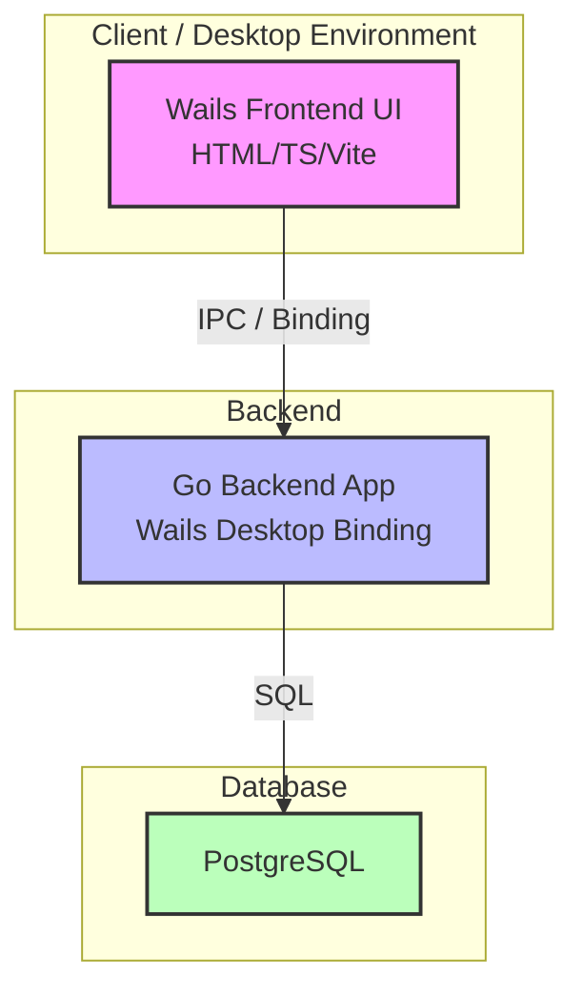

# Ethereum Web3 Desktop Wallet

Web3 Desktop Wallet application built with Go, Wails, React-TS, and PostgreSQL.

## 🏗️ System Architecture

Proyek Web3 Desktop Wallet ini menggunakan pola **3-Tier Containerized Architecture** untuk memastikan pemisahan tugas yang jelas antara antarmuka pengguna, logika backend, dan penyimpanan data persisten.

### Diagram Arsitektur
